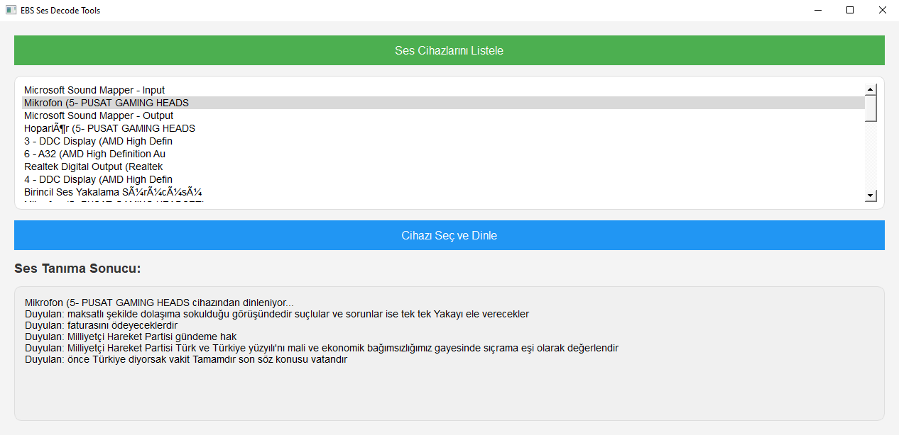

# EBS Ses Decode Tools

EBS Ses Decode Tools, kullanıcıların bilgisayarlarına bağlı ses cihazlarını listelemelerini ve seçtikleri cihazdan gelen sesleri tanımalarını sağlayan bir masaüstü uygulamasıdır. Uygulama, Python ve PyQt5 ile geliştirilmiştir ve ses tanıma işlemini Google Speech API ile yapmaktadır.

## Özellikler
- Ses cihazlarını listeleme
- Seçilen cihazdan ses dinleme
- Google Speech API ile ses tanıma
- Ses tanıma sonuçlarının görüntülenmesi

## Gereksinimler
Bu projeyi çalıştırabilmek için aşağıdaki kütüphanelerin yüklü olması gerekmektedir:
- `PyQt5`
- `pyaudio`
- `speech_recognition`

### Kütüphaneleri Yüklemek İçin:
```
pip install PyQt5 pyaudio speechrecognition
```

## Kullanım

1. **Ses Cihazlarını Listele**: Bu butona tıkladığınızda bilgisayarınıza bağlı tüm ses cihazları listelenir.
2. **Cihazı Seç ve Dinle**: Cihazlardan birini seçtikten sonra bu butona tıklayarak seçilen cihazdan gelen sesleri dinlemeye başlarsınız. Ses tanıma sonuçları ekranda gösterilecektir.

## Görseller

Uygulama arayüzü:



## Katkıda Bulunma
Bu projeye katkıda bulunmak için pull request gönderebilirsiniz. Herhangi bir hata veya öneri için Issues kısmını kullanabilirsiniz.

## Lisans
Bu proje MIT Lisansı altında lisanslanmıştır. Daha fazla bilgi için [Lisans Dosyasına](LICENSE) bakabilirsiniz.
